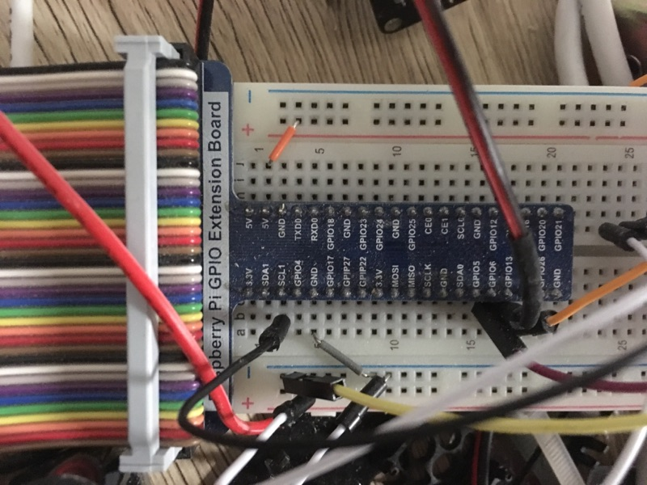

# server game mastering

  server game mastering pour contrôle différente partie d'un escape game.
  et connaître l’état physique des différente partie du jeux

  le server en question est héberge sur un Raspberry et communique avec les différente partie du jeux (énigme et trappe) en bus et gère les ouverture de deux porte en directe.

## les differente connection

* **image de présentation**

GPIO  | description
:-: |:-:
SDA1 | connexion arduino i2c (bus) transition donnée correspondance A4
SCL1 | connexion arduino i2c (bus) transition horloge correspondance A5
gpio06 | ouverture de la porte 1
gpio13 | ouverture de la porte 2
gnd | branchement branchement avec tout élément pour équilibre le courant

#### librairie
 - github.com/mlgd/gpio
